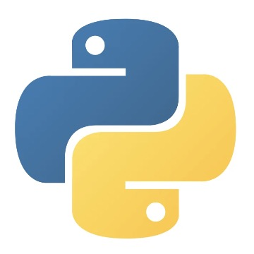
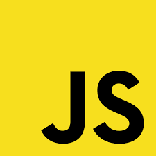
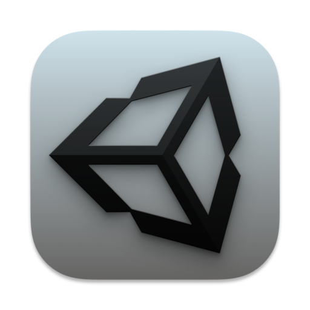
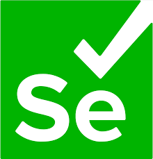
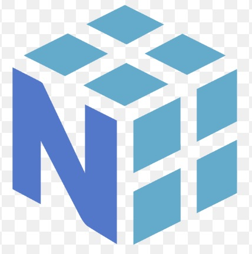
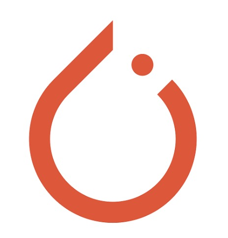
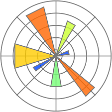
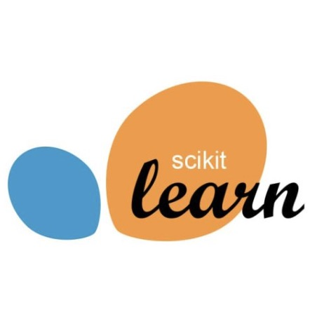

# Hello 🌙 I'm Ritsuki

### AI Engineer | Uncertainty Estimation / Evaluation Design

I am a master's student in engineering, focusing on machine learning and uncertainty estimation.  

🔗 Portfolio: [https://ritsuki-i.github.io/ritsuki-portfolio/](https://ritsuki-i.github.io/ritsuki-portfolio/)

---

## GitHub Stats

  
  

  
  

  
  

---

## Programming Languages

  
  
  
  
  
  

---

## Frameworks & Libraries

  
  
  
  
  
  
  
  

